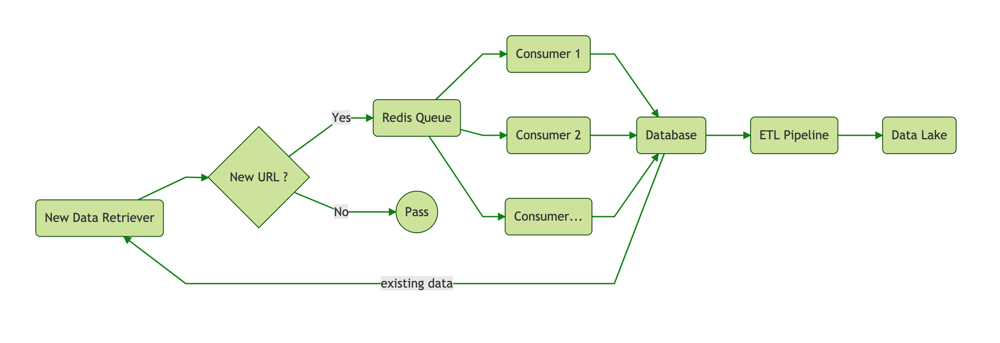

## Overview

Demonstration of distributed web scraper for [https://www.techinasia.com/jobs](https://www.techinasia.com/jobs) and its analytics data pipeline.

## Prerequisite

This guide assumes you have working installation of:

- **Docker Compose**
- **Postgres**
- **Redis**

## Guide

- Create 2 databases in your **Postgres** instance named `scraper` and `etl`
- Clone this repo by run `git clone https://github.com/pythonjokeun/web-scraper-data-pipeline`
- Enter the cloned repo.
- Open up `docker-compose.yml` in your favorite editor.
- Configure all the environment variables values accordingly.
- Run `docker-compose up --scale scraper-consumer=2`

**Notes:**

- If your working installation of **Postgres** or **Redis** running at your local machine, you can use `host.docker.internal` as the `[host]` value.
- The scraper and ETL data pipeline execution schedules are defined in the `CRON_SCHEDULE` variables using `cron` expression.
- The `--scale scraper-consumer=2` argument is used to define number of `scraper-consumer` instance.

## Design

Following image is the overview how the system looks like,

